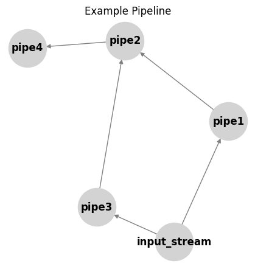

# 🧑‍🔧 Plumber

**Pipes, Joints and Pipelines** - A flexible & high-performance pipelining framework for reproducible research

Plumber is a lightweight Python framework for building directed acyclic graph (DAG) pipelines with topological sorting. It provides a clean abstraction for creating complex data processing workflows with automatic dependency resolution and parallel execution capabilities.

## 🎯 Key Features

- **Graph-based Pipeline Architecture**: Build complex workflows as directed acyclic graphs
- **Automatic Dependency Resolution**: Topological sorting ensures correct execution order
- **Flexible Node Types**: Support for Streams (data sources), Pipes (processors), and custom nodes
- **Cycle Detection**: Built-in protection against circular dependencies
- **Visualization**: NetworkX-based graph plotting for pipeline visualization
- **Extensible**: Easy to extend with custom pipe implementations

## 🏗️ Core Components

### Nodes
- **Stream**: Data source nodes that provide input to the pipeline
- **Pipe**: Processing nodes that transform data
- **Node**: Base class for all pipeline components

### Graph & Pipeline
- **Graph**: Manages the DAG structure with topological sorting
- **PipeLine**: Orchestrates the execution flow through the graph

## 🚀 Quick Start

### Basic Pipeline Example

```python
from plumber import Stream, Pipe, PipeLine

# Create a simple data source
class ExampleStream(Stream):
    def __init__(self, label: str) -> None:
        super().__init__(label)
        self.data[label] = "input_data"

# Create a processing pipe
class ExamplePipe(Pipe):
    def __init__(self, label: str) -> None:
        super().__init__(label)

    def pipe(self, inputs):
        # Process the input data
        return f"processed_{list(inputs.keys())}"

# Build the pipeline
input_stream = ExampleStream('input_stream')
processor = ExamplePipe('processor')

pipeline = PipeLine()
pipeline.register(input_stream, processor)
pipeline.flow(input_stream)
```

### Advanced Pipeline with Multiple Nodes

```python
# Create multiple processing stages
pipe1 = ExamplePipe('pipe1')
pipe2 = ExamplePipe('pipe2')
pipe3 = ExamplePipe('pipe3')

# Build a complex pipeline
pipeline = PipeLine()
pipeline.register(input_stream, pipe1)
pipeline.register(input_stream, pipe2)  # Parallel processing
pipeline.register(pipe1, pipe3)
pipeline.register(pipe2, pipe3)

# Execute the pipeline
pipeline.flow(input_stream)

# Visualize the pipeline
pipeline.plot(title="Example Pipeline")
```


## 📁 Project Structure

```
plumber/
├── __init__.py           # Main exports
├── graph.py              # Graph and topological sorting
├── node.py               # Base node classes
├── pipeline.py           # Pipeline orchestration
├── pipes/                # Specialized processing pipes
│   ├── daart_inf.py      # DAART model inference
│   ├── ensembler.py      # Model ensemble utilities
│   ├── ibl_marker.py     # IBL marker extraction
│   ├── ibl_overview.py   # Analysis visualization
│   └── ibl_utils.py      # IBL utilities
└── streams/              # Data source streams
    └── ibl_eid_stream.py # IBL experiment streams
```
